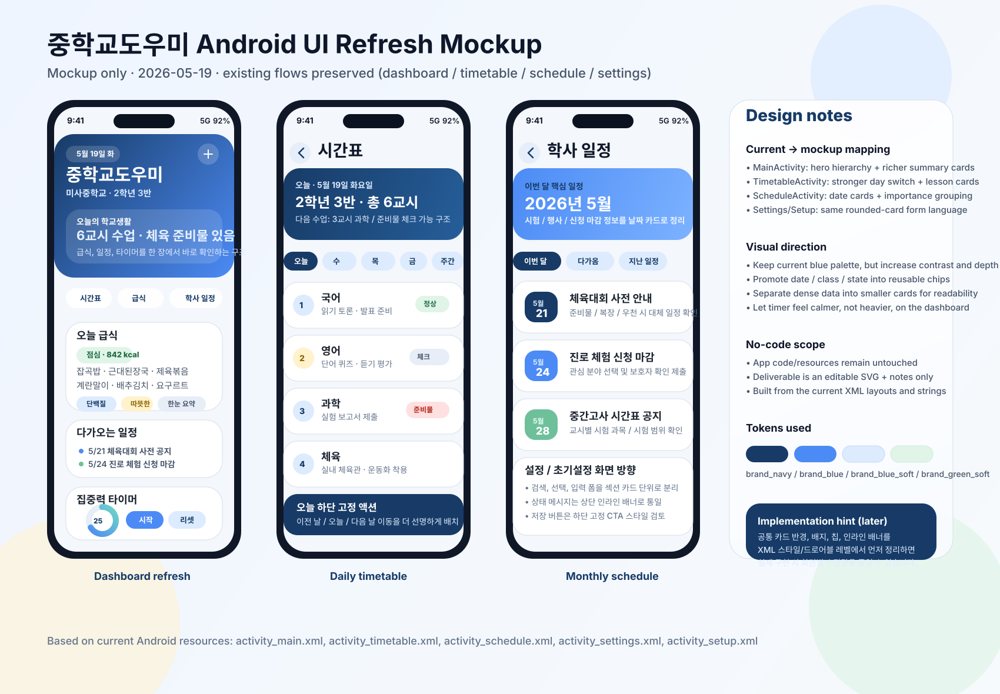

# Android UI refresh mockup

**Date:** 2026-05-19  
**Type:** mockup only / no app code changes

## Purpose

현재 Android 앱 UI를 더 보기 좋게 다듬기 위한 **시안(mockup)** 입니다.  
실제 구현 코드는 건드리지 않고, 현재 화면 흐름을 유지한 채 시각적 방향만 정리했습니다.

## Based on

- `android/app/src/main/res/layout/activity_main.xml`
- `android/app/src/main/res/layout/activity_timetable.xml`
- `android/app/src/main/res/layout/activity_schedule.xml`
- `android/app/src/main/res/layout/activity_settings.xml`
- `android/app/src/main/res/layout/activity_setup.xml`
- `android/app/src/main/res/values/colors.xml`
- `android/app/src/main/res/values/strings.xml`

## Screen mapping

- **왼쪽 폰:** `MainActivity` 대시보드 리프레시 방향
- **가운데 폰:** `TimetableActivity` 일간 시간표 화면 방향
- **오른쪽 폰:** `ScheduleActivity` 월간 일정 화면 방향
- **설정/초기설정:** 별도 폰으로 풀 렌더링하지 않고, 우측 노트 패널에 동일한 카드/폼 스타일 적용 방향만 정리

## Visual direction

1. 상단 요약 영역을 더 강한 히어로 카드로 정리
2. 버튼 대신 칩/퀵 액션을 섞어서 정보 접근성을 높임
3. 시간표/일정 리스트를 카드 단위로 분리해 가독성 개선
4. 현재 브랜드 팔레트(`brand_navy`, `brand_blue`, `brand_blue_soft`)를 유지하면서 그라디언트와 여백을 정돈
5. 타이머는 현재 기능을 유지하되 더 차분한 시선 흐름으로 배치

## If implemented later

- `MainActivity` 카드 간격, 타이포 계층, 요약 칩 시스템 정리
- `TimetableActivity` 날짜 이동 UI를 더 명확한 세그먼트/칩 구조로 재배치
- `ScheduleActivity` 이벤트 중요도 색상 구분 및 날짜 카드화
- `SettingsActivity` / `SetupActivity` 는 동일한 라운드 카드 + 섹션 헤더 + 상태 메시지 스타일로 통일

## Notes

- SVG라서 브라우저에서 바로 열 수 있고, Figma 등으로 가져가 추가 편집하기 쉽습니다.
- 이 시안은 현재 구현 범위를 벗어나지 않도록 **시간표 / 급식 / 일정 / 타이머 / 설정** 흐름을 그대로 유지했습니다.
- 로컬에서는 `qlmanage` 렌더링으로 SVG 미리보기를 확인했습니다.
